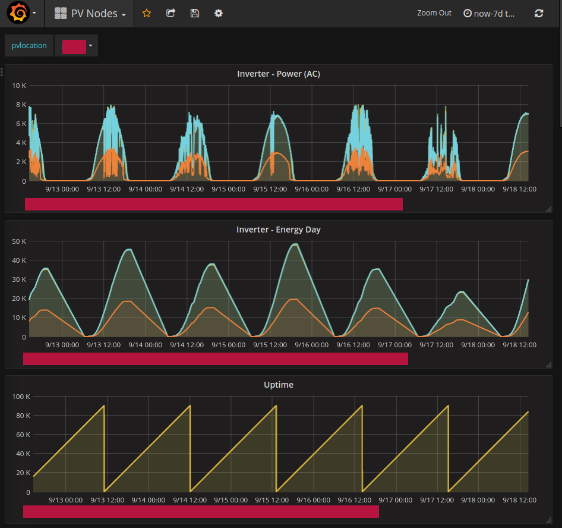
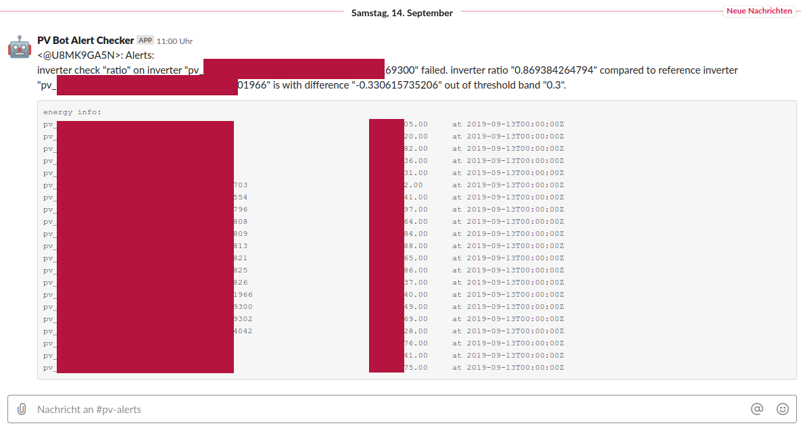

# Photovoltaic Monitoring Project

Monitor 5 photovoltaic plants for issues and, in case, send alerts.

Excerpt of one Grafana dashboard with some reported metrics

Excerpt of a Slack error notification with the rule which failed and details why it failed

## Project parts

* Datalogger for Kaco Inverter using [ESP8266 and Softuart](https://github.com/plieningerweb/esp8266-software-uart) to talk to GSM modem (remote location)
* Upgraded Datalogger to use Raspberry PIs to be able to remotely updated software and fix bugs
  * Interface with RS485 or bluetooth for [Kaco](https://github.com/plieningerweb/kacors485) or [SMA](https://github.com/plieningerweb/pyYASDI)
  * [Unsupervised Raspbery PIs for running in remote location](https://github.com/plieningerweb/raspberry-pi-iot-python-agent) (e.g. watchdog, read-only root, reverse ssh connection for updates and debugging)
  * [Python pv monitoring app](https://github.com/plieningerweb/pv-logger) on raspberry to tie it all together
    * Configuration file
	* Watchdog
	* Store measurements offline and [sync with InfluxDB server](https://github.com/plieningerweb/sqlite_influx_sync) once back online
* Webserver running [InfluxDB and Grafana setup with Ansible](https://github.com/plieningerweb/ansible-digitalocean-influxdb-grafana)
* Using Ansible managed reverse NGINX and letsencrypt for SSL protected access to Grafana
* Script on web server doing some tests every day and sending alerts in Telegram, Mail
  or Slack with overview of failed tests. Initially built with Kapacitor, but did not support calculation on separate series at the time. Furthermore Grafana did not support alerts at the time and later could not calculate the results, because InfluxDB's query language could not compare different series.

## Biggest Learnings (2015 to 2019)

#### Effort building vs maintaining

The time it takes to **build versus the time it takes to maintain** is very important to keep in mind.

* In the beginning at every device failure, had to drive half an hour to fix issues
* It took a lot of effort to fix every bug until it is now running flawlessly since 3 years
* Still, maintaining the web server, even mostly automated (upgrades, letsencrypt, etc) requires some work form time to time
* Overall effort until now was maybe 10x what I initially anticipated

#### Bugs in interfaces

The SMA interface is quite complex: Several issues require workarounds as well as retries in case of sudden random failures.

#### Limitations of new "hip" software, e.g. InfluxDB

InfluxDB was released with a big splash and used by many companies already, when I started this project. It was the "cool" new IoT database on the height of the IoT hype back then. Unfortunately, many key features were still missing after several years (calculation between series). Learning: Be skeptical of new technology and check key requirements first
